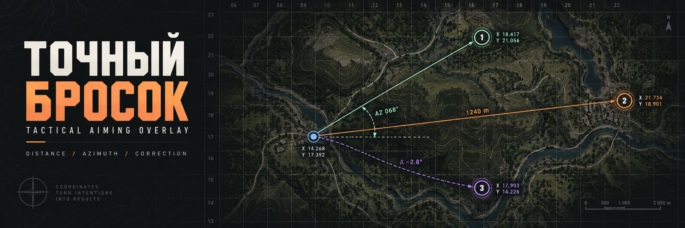
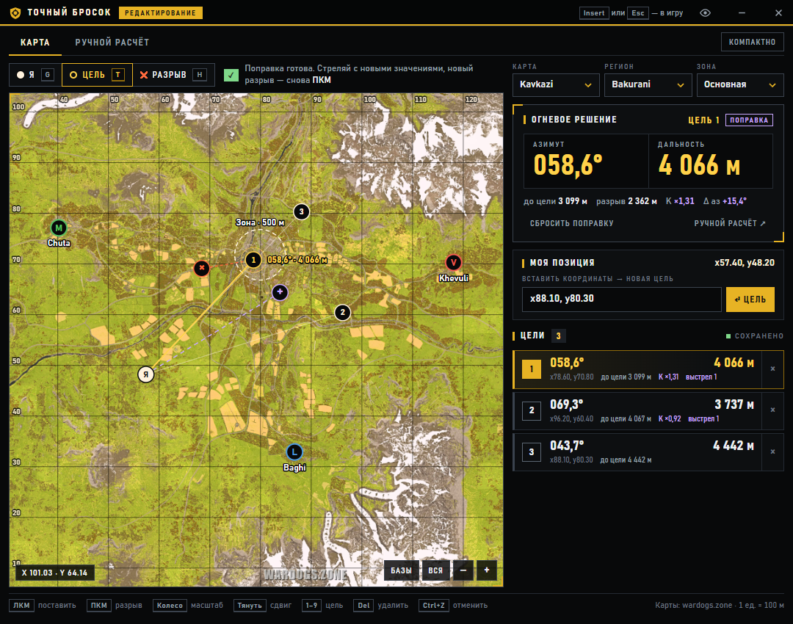
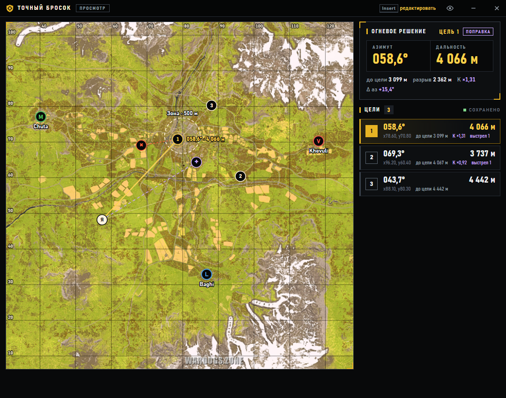
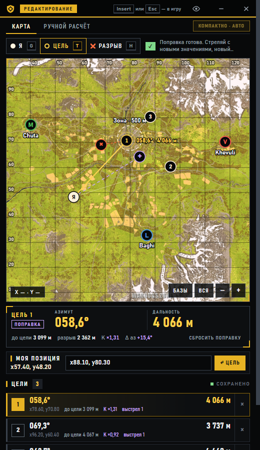
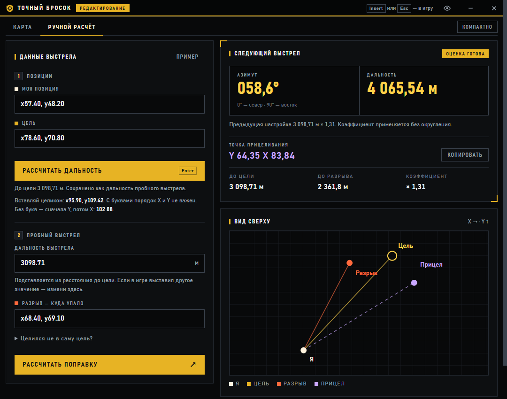

<p align="center"></p>

# Точный бросок — WARDOGS ballistic overlay

Unofficial always-on-top Windows overlay for artillery and mortar fire in [WARDOGS](https://store.steampowered.com/app/1867240/WARDOGS/). Mark your position and targets on an offline map, read the azimuth and range to dial in, then right-click where the shell landed to get a corrected shot.

**[Download for Windows](https://github.com/KustovYuriiUA/balistic-calculator-wardogs/releases/latest)** · [Русская версия](README.ru.md)



## Download and run

1. Open [Releases](https://github.com/KustovYuriiUA/balistic-calculator-wardogs/releases/latest) and download `balistic-calculator-wardogs-win-x64.zip`.
2. Unzip the whole archive. Keep all files together.
3. Run `Точный бросок.exe` from the unzipped folder. No installer, Node.js or internet connection is needed.

- Windows 10/11 x64.
- The EXE is not code-signed, so SmartScreen may warn on first launch: **More info → Run anyway**.
- Run the game in **windowed** or **borderless** mode. Exclusive fullscreen can hide overlay windows.

## Features

- **Offline maps:** Kavkazi, Europe and North America, with faction bases (Manticore, Valkyra, Lonestar) and the control zone of each region.
- **Fire solution:** big azimuth (`043,2°`) and range (`4 066 м`) readout for the selected target, also shown next to the target on the map.
- **Impact correction:** right-click where the shell landed to get the corrected azimuth and range. Follow-up impacts chain from the corrected shot, and each card shows its shot number.
- **Several targets** at once, each with its own correction.
- **Presets:** position and targets are saved separately for every map, region and zone, and restored after restart.
- **Click-through view mode** over the game; press **Insert** to switch to editing.
- **Undo** (Ctrl+Z) for every change of points. Hotkeys work on any keyboard layout.
- **Compact layout** for narrow windows: the map on top, the solution and target list below.
- **Manual calculator** for entering pasted coordinates without the map.

| View mode over the game | Compact layout | Manual calculator |
|---|---|---|
|  |  |  |

## How to use

1. Press **Insert** to enter edit mode. Top right, pick the map, region and zone of your match.
2. With the **Я** tool (G), click your position on the map, or paste coordinates such as `x95.90, y109.42` into the field and press Enter.
3. With the **Цель** tool (T), click one or more targets. The hint above the map always tells you the next step.
4. Dial the **azimuth** and **range** from the fire solution into the game and fire.
5. **Right-click** where the shell landed. The fire solution switches to the corrected values.
6. Missed again? Right-click the new impact. The next correction builds on the values you just fired with.
7. Press **Insert** or **Esc** to hand the mouse back to the game. The overlay stays visible and click-through.

## Controls

| Input | Action |
|---|---|
| `Insert` | Toggle view (click-through) / edit mode |
| `Esc` | Back to view mode |
| Left click | Place the point of the current tool |
| Right click | Mark the impact of the selected target |
| Drag (any button) | Pan the map; dragging never places points |
| Mouse wheel, `+` / `−` | Zoom |
| `G` / `T` / `H` | Tool: my position / target / impact |
| `1`–`9` | Select a target |
| `Delete` | Remove the selected target |
| `Ctrl+Z` | Undo |
| `F` / `R` | Fit the region's bases / show the whole map |

Clicking a target pin only selects it; it never deletes it. Clicking your own pin arms the **Я** tool, so the next click moves your position. The title bar buttons switch to view mode, hide the window (Insert brings it back) or quit. The tray icon offers the same actions.

## How the correction works

- One map unit is 100 m. Axes run 0–163.84: X to the east, Y to the north.
- Azimuth is measured clockwise from north: 0° north (+Y), 90° east (+X).
- Range is the horizontal distance by Pythagoras.
- **Range correction:** coefficient = distance to target ÷ distance to impact; new range = range fired × coefficient.
- **Direction correction:** the angle between the impact and where you aimed is subtracted from the direction to the target.

The model assumes a constant angular error and proportional range from the same position. It does not know terrain height or the game's ballistics, so treat each correction as an estimate and confirm it with the next shot.

## Safety and privacy

- The overlay is a regular Electron window with always-on-top and a global Insert hotkey. It does not attach to, read or modify the game process.
- It makes no network requests. Maps are bundled, and the page's Content Security Policy blocks connections.
- Presets and the window position are stored locally in `%APPDATA%\basketball-overlay`.

## Build from source

Requires Node.js and pnpm.

```bash
pnpm install
```

```bash
pnpm start
```

```bash
pnpm test
```

```bash
pnpm package
```

`pnpm package` builds a portable folder in `release/`. `node scripts/portable.cjs --maps` builds a single portable EXE with electron-builder. The UI checks in `tests/*-check.cjs` drive the app through Playwright's Electron support. Install `playwright`, or set `PLAYWRIGHT_PATH` to an existing copy, then run a check with `node tests/maps-check.cjs`.

Project layout: `desktop/` holds the Electron main process (window, Insert hotkey, tray). `dist/` holds the UI: `index.html`, `app.js` (calculator), `maps.js` (map, targets, presets), `style.css`/`maps.css` and the map images.

## Credits and license

- Map images and base/zone coordinates come from the public [Wardogs Zone artillery calculator](https://wardogs.zone/calculators/artillery); see [dist/maps/SOURCES.md](dist/maps/SOURCES.md). Game graphics belong to their owners.
- WARDOGS is developed by Bulkhead and published by Team17. This project is not affiliated with or endorsed by them.
- The code is released under the [MIT License](LICENSE). The license does not cover the map images and game data.
