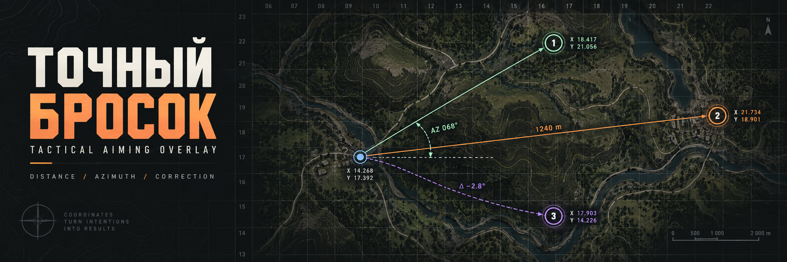
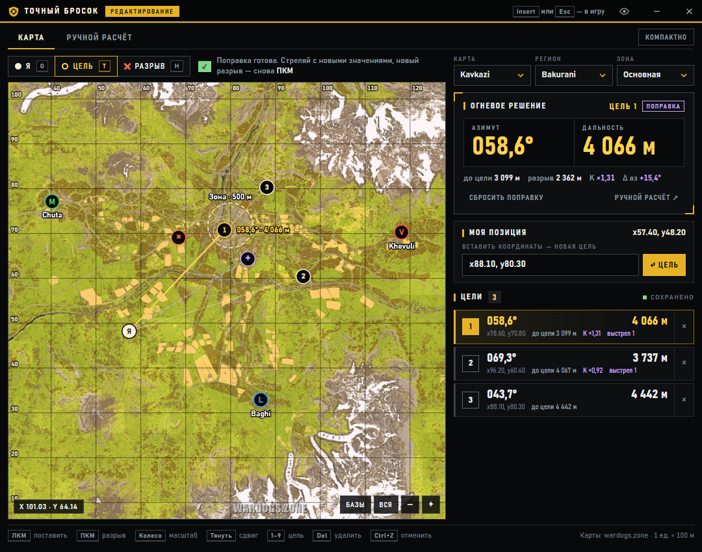
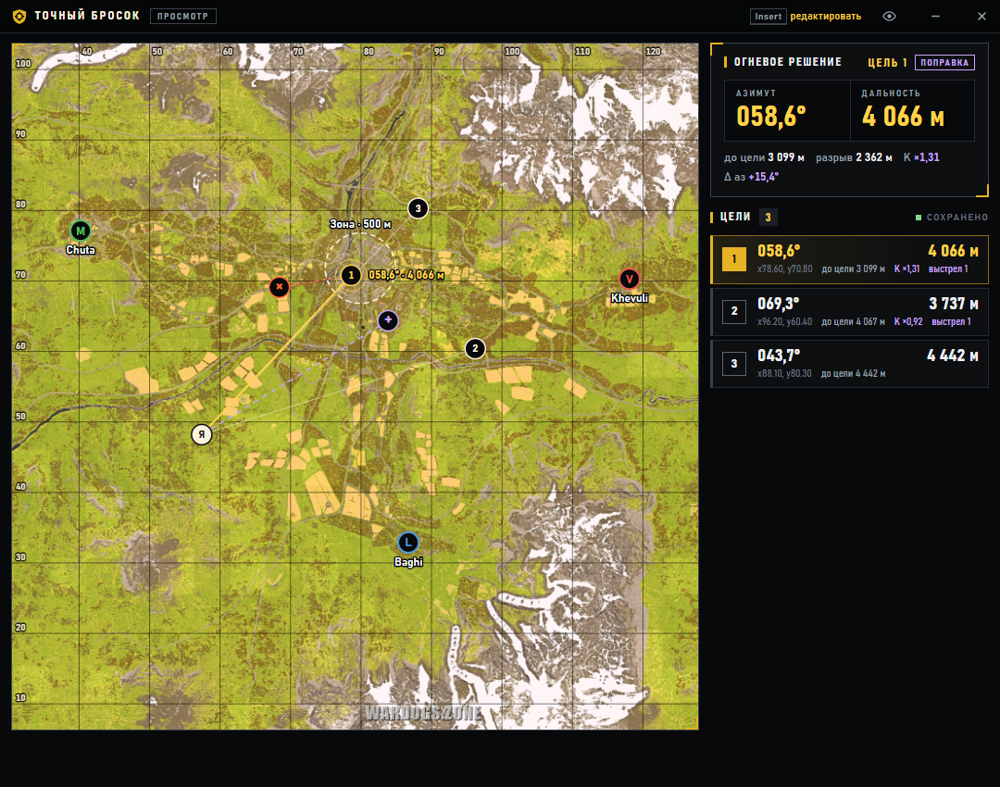
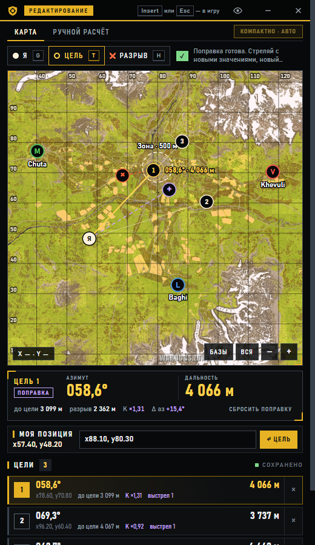
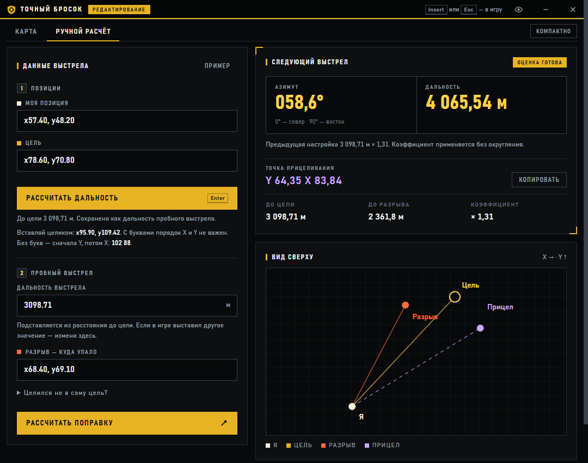

<p align="center"></p>

# Точный бросок — WARDOGS ballistic overlay

Unofficial always-on-top Windows overlay for artillery and mortar fire in [WARDOGS](https://store.steampowered.com/app/1867240/WARDOGS/). Mark your position and targets on an offline map, read the azimuth and range to dial in, then right-click where the shell landed to get a corrected shot.

**[Download for Windows](https://github.com/KustovYuriiUA/balistic-calculator-wardogs/releases/latest)** · [Русская версия](README.ru.md)



## Download and run

1. Open [Releases](https://github.com/KustovYuriiUA/balistic-calculator-wardogs/releases/latest) and download `balistic-calculator-wardogs-win-x64.zip`.
2. Unzip the whole archive. Keep all files together.
3. Run `Точный бросок.exe` from the unzipped folder. No installer, Node.js or internet connection is needed.

- Windows 10/11 x64.
- The EXE is not code-signed, so SmartScreen may warn on first launch: **More info → Run anyway**.
- Run the game in **windowed** or **borderless** mode. Exclusive fullscreen can hide overlay windows.

## Features

- **Offline maps:** Kavkazi, Europe and North America, with faction bases (Manticore, Valkyra, Lonestar) and the control zone of each region.
- **Fire solution:** big azimuth (`043,2°`) and range (`4 066 м`) readout for the selected target, also shown next to the target on the map.
- **Impact correction:** right-click where the shell landed to get the corrected azimuth and range. Follow-up impacts chain from the corrected shot, and each card shows its shot number.
- **Game map layer (beta):** outline the in-game map (M) on screen once. The overlay then calibrates it by itself, by the green zone circle or by matching the terrain against the offline maps when the circle is out of view. It recognises the map and zone, draws your position, targets and the fire solution over the game map, and shows game coordinates next to your cursor. Press **Insert** with the map open to place points by clicking the game map itself.
- **Several targets** at once, each with its own correction.
- **Presets:** position and targets are saved separately for every map, region and zone, and restored after restart.
- **Click-through view mode** over the game; press **Insert** to switch to editing.
- **Undo** (Ctrl+Z) for every change of points. Hotkeys work on any keyboard layout.
- **Compact layout:** **Компактно** narrows the window to 420 px at the nearer screen edge, with the map on top and the solution and target list below. Its height follows the content, so viewing (less shown) is shorter than editing and there is no empty space; up to 10 targets show in full, more scroll. **Полный вид** restores the previous size, and the choice survives a restart. A window narrowed by hand switches to the compact layout by itself. In the manual calculator the result moves above the inputs.
- **Manual calculator readout:** the azimuth sits in a highlighted cell with bigger digits and the range is in cream, so the two values never blend.
- **Manual calculator** for entering pasted coordinates without the map.
- **Auto-update** from GitHub Releases: the overlay downloads new versions in the background and restarts into them when you click **↻ Обновить до …**.

| View mode over the game | Compact layout | Manual calculator |
|---|---|---|
|  |  |  |

## How to use

1. Press **Insert** to enter edit mode. Top right, pick the map, region and zone of your match.
2. With the **Я** tool (G), click your position on the map, or paste coordinates such as `x95.90, y109.42` into the field and press Enter.
3. With the **Цель** tool (T), click one or more targets. The hint above the map always tells you the next step.
4. Dial the **azimuth** and **range** from the fire solution into the game and fire.
5. **Right-click** where the shell landed. The fire solution switches to the corrected values.
6. Missed again? Right-click the new impact. The next correction builds on the values you just fired with.
7. Press **Insert** or **Esc** to hand the mouse back to the game. The overlay stays visible and click-through.

### Game map layer (beta)

1. Open the map in the game (M). In the overlay, click **Выбрать область захвата** next to the tools above the map (**Область** in the compact window), or use the ☰ menu or the tray menu. Once an area is saved, the button reads **Сменить область захвата**. **Скрыть карту** / **Показать карту** next to it toggles the overlay's own map.
2. The screen dims. Drag a rectangle around the in-game map square; a margin is fine. Once the map is calibrated, the overlay finds the square map panel inside the rectangle and fits the area to it exactly, so nothing around the map is analysed (message **Область захвата подогнана под карту игры**). Esc or right-click cancels. The area is saved for that monitor and resolution. After a resolution change, select it again.
3. While the game map is closed, the row reads **жду карту M**. When the map is open, the layer draws your position, targets, lines and the fire solution over it, as on the overlay's own map. It also prints `x… y…` below and to the left of your cursor; the game prints its own readout on the right.
4. **Calibration.** When the zone circle is in view, the layer uses it: a dashed outline marks the circle it found. The circle may be any colour, and its edge is found whether it is a thin line or a wide glow, which changes with the zoom. A circle only counts once the terrain inside it matches a known zone. The layer then knows the zone, and the overlay switches its map, region and zone to match, while marker circles and pings are ignored. When the circle is out of view (zoomed in or panned away), the layer matches the terrain against the offline maps instead, and the row reads **по местности**. The first terrain search takes about half a second per map. After that the layer follows every zoom and pan of the game map, including a zoom step that doubles or halves the scale.
5. **Marker mode.** With the game map open, press **Insert**. The layer takes the mouse: left-click places the current tool (**Я** or **Цель**), right-click marks the impact of the selected target, and a click on a pin selects or removes it, as on the overlay's map. G/T/H, 1–9, Delete and Ctrl+Z work too. The overlay window stays clickable meanwhile, for the tools, the list or the menu, while the keyboard stays on the game map. Press **Insert** or **Esc** to hand the mouse back to the game. While marker mode is on, the game map cannot be zoomed or panned, so leave it, move the map, then press Insert again. With the game map closed, Insert opens the overlay window for editing as before. If the layer has not found the map yet, Insert first searches for it, taking about half a second (a second the first time), and shows **Ищу карту игры…** over the game map meanwhile. The **Карта игры** row also shows a spinner while the capture starts or a terrain search runs.

6. **Menu** (☰, top left of the overlay window): **Размер шрифта** scales the whole overlay window to 90, 100 (the default), 115 or 130 %; the compact window widens with it. **Карта в окне оверлея** hides or shows the overlay's own map. Without it, the window shows only your position, the fire solution and the targets, and a **Показать карту** button brings the map back. **Частота опроса карты игры** sets how often the game map is analysed: 15, 30, 60 (the default) or 120 frames per second. Unchanged frames cost nothing, so a high rate only uses CPU while the map moves. **Снимок карты игры для отладки** saves the frame the layer sees and what it found there to the `diagnostics` folder of the profile and opens that folder. Send those files when something goes wrong.

At the default map zoom one screen pixel is about 1.3 m. The circle is measured at its outer edge, where the tint ends; its scale then equals the spacing of the game's axis labels, which are 100 m apart. Readings match the game grid within 1–2 m by the circle and by the terrain alike. The coordinates the game prints next to its cursor can lag or be offset by several metres (13 m on one screenshot), so check against the grid lines. The layer is hidden from screenshots and recordings so that its own drawings never confuse the search. While the game map is closed, the terrain search runs in the background at most every 4–15 seconds.

## Controls

| Input | Action |
|---|---|
| `Insert` | Toggle view (click-through) / edit mode; with the game map open, toggle marker mode on it |
| `Esc` | Back to view mode |
| Left click | Place the point of the current tool |
| Right click | Mark the impact of the selected target |
| Drag (any button) | Pan the map; dragging never places points |
| Mouse wheel, `+` / `−` | Zoom |
| `G` / `T` / `H` | Tool: my position / target / impact |
| `1`–`9` | Select a target |
| Click the selected pin, `Delete` | Remove the selected target |
| `Ctrl+Z` | Undo |
| `Z` / `F` / `R` | Fit the zone circle / the region's bases / show the whole map (also the **Зона**, **Базы**, **Вся** buttons) |

Clicking a target pin selects it; clicking the selected pin again removes it (Ctrl+Z brings it back). After a removal the remaining targets are renumbered 1…n, so card N is always hotkey N and a new target gets the next number. Clicking your own pin removes it and arms the **Я** tool, so the next click places it again (Ctrl+Z brings it back). The title bar buttons switch to view mode, hide the window (Insert brings it back) or quit. The tray icon offers the same actions.

## How the correction works

- One map unit is 100 m. Axes run 0–163.84: X to the east, Y to the north.
- Azimuth is measured clockwise from north: 0° north (+Y), 90° east (+X).
- Range is the horizontal distance by Pythagoras.
- **Range correction:** coefficient = distance to target ÷ distance to impact; new range = range fired × coefficient.
- **Direction correction:** the angle between the impact and where you aimed is subtracted from the direction to the target.

The model assumes a constant angular error and proportional range from the same position. It does not know terrain height or the game's ballistics, so treat each correction as an estimate and confirm it with the next shot.

## Updates

The overlay checks [the latest release](https://github.com/KustovYuriiUA/balistic-calculator-wardogs/releases/latest) 8 seconds after start and then every 6 hours.

1. When a newer version appears, it downloads `app-<version>.zip` (code and maps, about 23 MB) in the background and verifies its size and SHA-256 against `update.json` from the same release.
2. The title bar shows **↻ Обновить до <version>**. Click it, or use the tray menu, to restart into the new version whenever it suits you. Without a restart the update is used on the next launch.
3. If the new version fails to start twice, the overlay falls back to the version in the unzipped folder.

Updates are unpacked into `%APPDATA%\basketball-overlay\updates`; the unzipped folder itself is never modified. A release built on a different Electron runtime shows **↗ Версия <version>** instead, which opens the release page for a full download.

Tray menu: **Проверить обновления** checks now; **Обновлять автоматически** turns background checks on or off.

## Safety and privacy

- The overlay is a regular Electron window with always-on-top and a global Insert hotkey. It does not attach to, read or modify the game process.
- The game map layer captures only the screen area you selected, analyses frames in memory and never sends them. A frame is written to disk only when you pick **Снимок карты игры для отладки**.
- The only network traffic is the update check and download, to `api.github.com` and GitHub's release file servers. Turn off **Обновлять автоматически** in the tray menu to stop it. The map page itself is blocked from any connection by its Content Security Policy, and the maps are bundled.
- Presets, the window position and downloaded updates are stored locally in `%APPDATA%\basketball-overlay`.

## Build from source

Requires Node.js and pnpm.

```bash
pnpm install
```

```bash
pnpm start
```

```bash
pnpm test
```

```bash
pnpm package
```

`pnpm package` builds a portable folder in `release/`. `pnpm release` builds everything a GitHub release needs: `release/balistic-calculator-wardogs-win-x64.zip`, `release/app-<version>.zip` and `release/update.json`. `node scripts/portable.cjs --maps` builds a single portable EXE with electron-builder. The UI checks in `tests/*-check.cjs` drive the app through Playwright's Electron support. Install `playwright`, or set `PLAYWRIGHT_PATH` to an existing copy, then run a check with `node tests/maps-check.cjs`. Four checks of the game map layer need only Electron: `pnpm exec electron tests/zone-check.cjs` runs the circle search and zone recognition on a real screenshot, `pnpm exec electron tests/terrain-check.cjs` the terrain matching (acquire, track, recover, zoom) on it and on frames rendered from the offline maps, `pnpm exec electron tests/layer-check.cjs` runs the whole layer on your screen against a stand-in game window (100 % display scaling), and `pnpm exec electron tests/soak-check.cjs` samples the memory of every process for 2.5 minutes of rim tracking, terrain tracking and waiting (`SHOT_TEST_NO_GPU=1` repeats it without GPU acceleration). After changing the maps or `landmarks-data.js`, rebuild the zone patches and the 512² grey terrain images for the wide search (`dist/zone-patches.js`, `dist/maps/terrain-*.png`) with `pnpm zone-patches`.

Project layout: `desktop/` holds the Electron main process (`boot.cjs` entry that picks the downloaded update or the bundled app, window, Insert hotkey, tray, `updater.cjs`, and `map-layer.cjs` with `map-area.cjs` for the game map layer and area picker). `dist/` holds the UI: `index.html`, `app.js` (calculator), `maps.js` (map, targets, presets), `style.css`/`maps.css` and the map images. The layer lives in `layer.html`/`layer.js`, the picker in `area-picker.html`/`area-picker.js`, the circle search and zone recognition in `zone-detect.js`, the terrain matching in `terrain-match.js`, and the generated zone patches in `zone-patches.js`.

## Release flow

Branches: `dev` for work in progress, `master` for released code.

1. Work on `dev` and push. The **CI** workflow runs the unit tests on every push to `dev` and on pull requests.
2. When ready to ship, bump `"version"` in `package.json` on `dev` (for example `1.0.1`). The updater only offers versions greater than the installed one.
3. Merge `dev` into `master` (pull request or fast-forward) and push.
4. The **Release** workflow builds on `windows-latest`: it installs dependencies, runs the tests, runs `pnpm release` and publishes the release `v<version>` with the three files. If a release with that version already exists, the workflow skips publishing, so pushes to `master` without a version bump are safe.
5. Installed overlays pick the release up within 6 hours, or immediately via **Проверить обновления** in the tray.

`node tests/update-check.cjs` exercises the whole update path against a local fake of the GitHub API: download, checksum, staging, restart into the new version, rejected tampered files.
## Credits and license

- Map images and base/zone coordinates come from the public [Wardogs Zone artillery calculator](https://wardogs.zone/calculators/artillery); see [dist/maps/SOURCES.md](dist/maps/SOURCES.md). Game graphics belong to their owners.
- WARDOGS is developed by Bulkhead and published by Team17. This project is not affiliated with or endorsed by them.
- The code is released under the [MIT License](LICENSE). The license does not cover the map images and game data.
